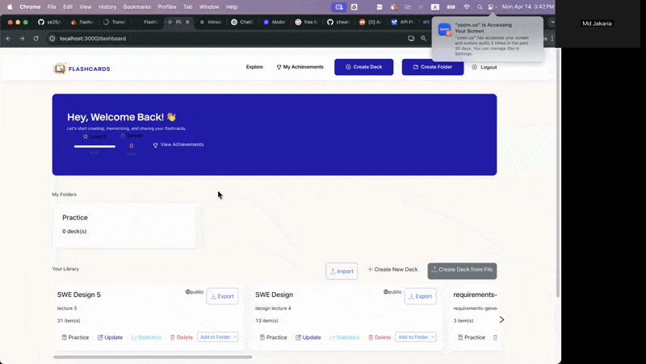
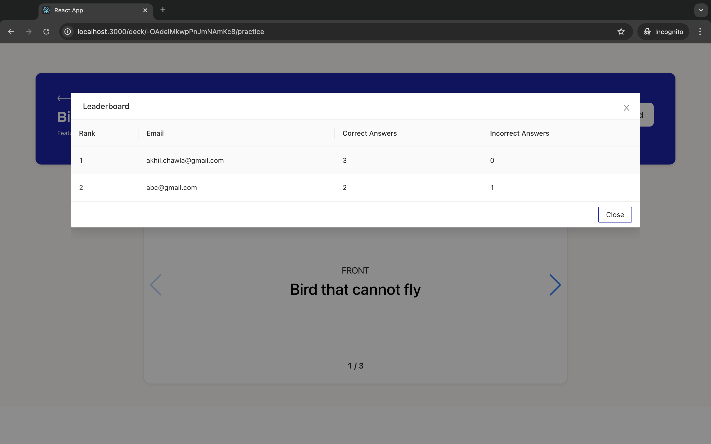

<!-- Logo image -->
<p align="center">
  
</p>

<p align="center">

<!-- Licence Badge -->
<a href="https://github.com/NCSU-SE-Spring2025-Group6/FlashCards_Spr25-G6/blob/main/LICENSE">
</a>

<!-- Workflow Badge -->
<a href="https://github.com/NCSU-SE-Spring2025-Group6/FlashCards_Spr25-G6/blob/main/.github/workflows/backend_tests.yml" alt="Python Backend Tests">
 </a>


<!-- Codecov Badge -->
<a href="https://codecov.io/gh/NCSU-SE-Spring2025-Group6/FlashCards_Spr25-G6" >
 </a>

<!-- add more badges  -->

<!-- Python Version Badge -->
<a href="https://www.python.org/downloads/release/python-3122/" alt="Python version">
 </a>

<!-- Release Badge -->
<a href="https://img.shields.io/github/release/JohnDamilola/FlashCards?color=brightblue" alt="Release">
 </a>

<!-- Ruff Badge -->
<a href="https://img.shields.io/badge/ruff-v0.9.7-brightgreen.svg" alt="Ruff version">
 </a>

<!-- Zenodo Badge -->
<a href="https://doi.org/10.5281/zenodo.14928027">
</a>


</p>


## Description
Are you a student and having trouble preparing for tests and exams? Look no further. FlashCards also helps you memorize all that hard-to-remember information with online flashcards so that you ace your exams!

FlashCards is a spaced repetition learning platform to <b>create</b>, <b>memorize</b> and <b>share</b> your knowledge list using flashcards.

1. Create folders
2. Add decks to folder
3. Decks in folder redirected to Practice Deck
4. Leaderboard
5. Quiz Mode
6. Recently visited Decks

## Watch FlashCards in Action

https://github.com/user-attachments/assets/22c3f244-ed5f-477e-b1d9-5d24dc524ba1

## Tech Stack
<a href="https://flask.palletsprojects.com/en/2.2.x/"></a>
<a href="https://www.typescriptlang.org/"></a>
<a href="https://reactjs.org/"></a>
<a href="https://firebase.google.com/"></a>
<a href="https://github.com/"></a>
<a href="https://ant.design/"></a>
<a href="https://www.heroku.com/"></a>

## Installation
```bash
conda create -n flashcards python=3.12.2
conda activate flashcards
pip3 install .
```

## Getting started:
- **Backend** -> [See README.md](backend/README.md)
- **Frontend** -> [See README.md](frontend/README.md)

## Gamification System

Our new gamification system helps users stay motivated and track their learning progress:

### How to Earn XP Points:
- **Reviewing Cards**: 5-15 XP per card based on recall quality
- **Daily Streaks**: Maintain a streak for XP bonuses (up to 50% extra)
- **Completing Quizzes**: 20-50 XP depending on your score
- **Unlocking Achievements**: Special achievements award 30-500 XP

### Features:
- **Level System**: Progress through levels as you earn XP
- **Achievement Badges**: Unlock achievements for study milestones
- **Streaks**: Track daily activity with streak counters
- **Leaderboard**: Compete with other users based on XP

### Firebase Database Setup for Gamification:
To enable the gamification system, add these rules to your Firebase Realtime Database:
```json
"user_gamification": {
    ".read": true,
    ".write": true,
    ".indexOn": ["userId", "xp"]
}
```

## Create Deck from Lecture Materials (Plain Text) Using LLM
In this version, we implemented a feature designed to simplify student life and enhance their exam preparation like never before. With this feature, users can simply upload lecture materials, and the Gemini model will automatically generate decks containing the most important questions and answers from the content. A demo of this functionality is showcased below. 


## New Showcase

Screenshots can also be viewed in these galleries:

- [Gallery 1](https://gg.teddysc.me/?g=c8cf2567f52c2540d0ee450fa4642976&a)
- [Gallery 2](https://gg.teddysc.me/?g=df6986ece2f566e5c24f84b0fa199453&a)


### Gamification Feature Screenshots


*Dashboard showing Level, XP progress, and Streak counter*


*Gamification Profile with achievements and leaderboard*


*Earning XP after completing a quiz*

### Creating Deck from Plain Text 



## Old Showcase

<p style="display: flex; flex-direction: column; align-items: center; gap: 15px;">
  
  
  
  
  
  
  
</p>

## Contributions to the Project

Please refer to the [Contributing.md](/Contributing.md) if you want to contribute to the FlashCards source code. Follow all the guidelines mentioned and raise a pull request for the developers to review before the code goes to the main source code.

## New Feature: 
- [x] (Branch: `space-repetition-schedule-visualization`) Currently, a spaced repetition learning algorithm has been implemented (SM-2), but users are not able to see a schedule for when certain cards should be reviewed. We would like to add a dashboard to allow users to see statistics about when certain cards are up for review, and other statistics such as how confident they are or how often certain cards are correctly answered.
- [x] We have a few tests that are failing. They are primarily failing because of API endpoints that should return an error status code when given invalid data, but aren't. These would be good "first issues" to onboard new developers, and give them a good bite-sized problem to solve.
- [x] (Branch: `gamification-xp-tracking`, implemented with recharts.js) "Gamify" the system by adding rewards, an XP based progression system, and streaks for consistently completing the aforementioned spaced repetition for consecutive days in a row.

- [x] (**New feature**, Branch: `deck-from-file`) We have introduced a new feature that allows users to create flashcard decks directly from uploaded files. This feature leverages advanced natural language processing to extract key information and generate meaningful flashcards. How It Works: **1. Upload a File**: Users can upload lecture notes, PDFs, or plain text files. **2. Automatic Processing**: The system processes the file to identify important concepts, questions, and answers. **3. Deck Creation**: A new deck is automatically generated with flashcards based on the uploaded content. Supported File Formats: Plain Text (`.txt`)


## Future Plan

- [] The `deck-from-file` feature currently only accepts plain text files. In future versions, we plan to extend support to other formats such as audio, video, PDFs, webpages, and document files (e.g., `.docx`).
## Help

Email any queries to the contributors

## Authors 

1. [Akhil Chawla](achawla@ncsu.edu)
2. [Sanjana Dalal](sdalal2@ncsu.edu)
3. [Priya Gandhi](pgandi4@ncsu.edu)


1. [Jeff Powell](https://github.com/jeff-pow)
2. [Zeiad Yakout](https://github.com/https://github.com/zeiadyakout)
3. [Jakub Jon](https://github.com/lnotspotl)

1. [Teddy C](xchen87@ncsu.edu)
2. [Md Jakaria](mjakari@ncsu.edu)
3. [Autumn Wright](jmwrigh3@ncsu.edu)

## License

[MIT](https://tldrlegal.com/license/mit-license)


## Funding

Our project at the moment is not funded by any organization/individual.
